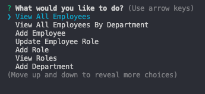
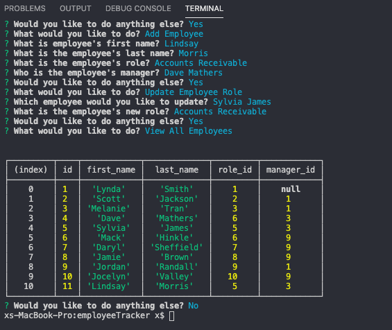

# employeeTracker

# Note Taker

## Table of Contents:
*[Description](#description)  
*[Images](#images)  
*[Installation](#installation)  
*[Usage](#usage)  
*[License](#license)  
*[Contribute](#contribute)  
*[Tests](#tests)  
*[Questions](#questions)  

## DESCRIPTION:

In this homework assignment, your challenge is to architect and build a solution for managing a company's employees using node, inquirer, and MySQL.

## IMAGES:

## INSTALLATION

node express
node uuid

## USAGE

As a business owner
I want to be able to view and manage the departments, roles, and employees in my company
So that I can organize and plan my business

## LICENSE

N/A

## CONTRIBUTE

N/A

## TESTS

N/A

## QUESTIONS

GitHub: lindsaymorris813
Email: lindsaymorris813@gmail.com